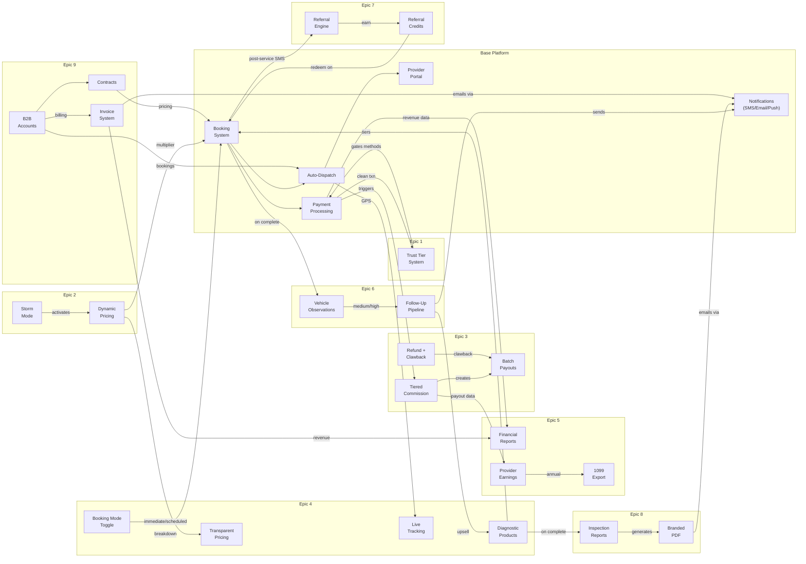
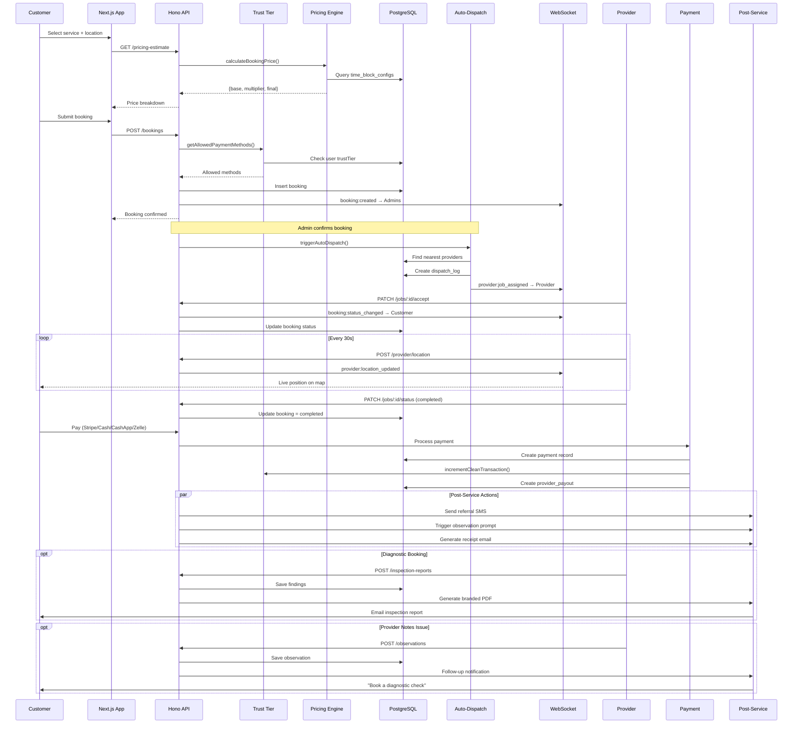

# System Architecture - RoadSide ATL

## Full Platform Architecture

```mermaid
flowchart TB
    subgraph Clients["Client Layer"]
        direction LR
        MKT["Marketing Pages<br/>(SEO, JSON-LD)"]
        BOOK["Booking Flow<br/>(4-step wizard)"]
        CUST["Customer Dashboard<br/>(history, referrals, invoices)"]
        PROV["Provider Portal<br/>(jobs, inspections, observations)"]
        ADMIN["Admin Panel<br/>(bookings, providers, B2B, finance)"]
    end

    subgraph RT["Real-Time Layer"]
        WS["WebSocket Server<br/>(ws, 30s heartbeat)"]
    end

    subgraph API["Hono REST API"]
        direction LR
        AUTH_R["Auth Routes<br/>(register, verify,<br/>reset, OAuth)"]
        BOOK_R["Booking Routes<br/>(create, list,<br/>cancel)"]
        PAY_R["Payment Routes<br/>(Stripe checkout,<br/>manual confirm)"]
        PROV_R["Provider Routes<br/>(jobs, location,<br/>availability)"]
        ADMIN_R["Admin Routes<br/>(bookings, providers,<br/>customers, audit)"]
        B2B_R["B2B Routes<br/>(accounts, contracts,<br/>B2B bookings)"]
        INV_R["Invoice Routes<br/>(generate, send,<br/>PDF, status)"]
        FIN_R["Financial Routes<br/>(overview, revenue<br/>breakdown, export)"]
        TT_R["Trust Tier Routes<br/>(config, promote,<br/>list)"]
        PRICE_R["Pricing Routes<br/>(config, storm mode,<br/>estimate)"]
        OBS_R["Observation Routes<br/>(submit, checklist,<br/>list)"]
        REF_R["Referral Routes<br/>(validate, apply,<br/>redeem, balance)"]
        INSP_R["Inspection Routes<br/>(submit, PDF,<br/>email)"]
        REV_R["Review Routes<br/>(create, list,<br/>update)"]
        PUSH_R["Push Routes<br/>(subscribe,<br/>unsubscribe)"]
        WH_R["Webhook Routes<br/>(Stripe events)"]
    end

    subgraph BL["Business Logic Layer"]
        direction LR
        DISPATCH["Auto-Dispatch<br/>Engine"]
        PRICING["Pricing Engine<br/>(time blocks,<br/>storm mode)"]
        PAYOUT["Payout Calculator<br/>(tiered commission,<br/>clawback)"]
        TRUST["Trust Tier<br/>Engine<br/>(promotion logic)"]
        REFCRED["Referral Credit<br/>Engine<br/>(generate, redeem)"]
        INVGEN["Invoice Generator<br/>(numbering,<br/>monthly batch)"]
        PDFGEN["PDF Generator<br/>(inspections,<br/>invoices)"]
        AUDIT["Audit Logger<br/>(buffered writes,<br/>20+ action types)"]
        RATELIM["Rate Limiter<br/>(5 tiers,<br/>sliding window)"]
    end

    subgraph DB["PostgreSQL 16 — Drizzle ORM"]
        direction LR
        T_USERS["users<br/>(trustTier,<br/>referralCode)"]
        T_BOOK["bookings<br/>(priceOverride,<br/>referralCredit)"]
        T_SVC["services"]
        T_PROV["providers<br/>(commission,<br/>location)"]
        T_PAY["payments<br/>(refund fields)"]
        T_POUT["provider_payouts<br/>(clawback)"]
        T_DISP["dispatch_logs"]
        T_REV["reviews"]
        T_OBS["observations"]
        T_REF["referrals"]
        T_INSP["inspection_reports"]
        T_B2B["b2b_accounts<br/>(contract)"]
        T_INV["invoices<br/>(line items)"]
        T_TBC["time_block_configs"]
        T_PSET["platform_settings"]
        T_PUSH["push_subscriptions"]
        T_AUTH["auth tables<br/>(accounts, sessions,<br/>tokens, invites)"]
    end

    subgraph EXT["External Services"]
        direction LR
        STRIPE["Stripe<br/>(checkout, webhooks,<br/>refunds)"]
        TWILIO["Twilio<br/>(SMS notifications,<br/>referral texts)"]
        RESEND["Resend<br/>(email, verification,<br/>receipts, reports)"]
        GMAPS["Google Maps<br/>(Places, Geocoding,<br/>AdvancedMarker)"]
        VAPID["Web Push<br/>(VAPID keys,<br/>browser push)"]
    end

    %% Client → API connections
    MKT --> AUTH_R
    BOOK --> BOOK_R
    BOOK --> PAY_R
    BOOK --> PRICE_R
    BOOK --> REF_R
    CUST --> BOOK_R
    CUST --> REV_R
    CUST --> REF_R
    CUST --> PUSH_R
    PROV --> PROV_R
    PROV --> OBS_R
    PROV --> INSP_R
    PROV --> REF_R
    ADMIN --> ADMIN_R
    ADMIN --> B2B_R
    ADMIN --> INV_R
    ADMIN --> FIN_R
    ADMIN --> TT_R
    ADMIN --> PRICE_R

    %% Client ↔ WebSocket
    CUST <--> WS
    PROV <--> WS
    ADMIN <--> WS

    %% API → Business Logic
    BOOK_R --> DISPATCH
    BOOK_R --> PRICING
    BOOK_R --> TRUST
    BOOK_R --> REFCRED
    PAY_R --> TRUST
    PAY_R --> PAYOUT
    ADMIN_R --> AUDIT
    ADMIN_R --> PAYOUT
    B2B_R --> DISPATCH
    B2B_R --> PRICING
    B2B_R --> INVGEN
    INV_R --> INVGEN
    INV_R --> PDFGEN
    TT_R --> TRUST
    PRICE_R --> PRICING
    OBS_R --> AUDIT
    REF_R --> REFCRED
    INSP_R --> PDFGEN
    WH_R --> PAYOUT
    WH_R --> TRUST
    FIN_R --> AUDIT

    %% Business Logic → DB
    DISPATCH --> T_DISP
    DISPATCH --> T_PROV
    DISPATCH --> T_BOOK
    PRICING --> T_TBC
    PRICING --> T_SVC
    PAYOUT --> T_POUT
    PAYOUT --> T_PAY
    TRUST --> T_USERS
    TRUST --> T_PSET
    REFCRED --> T_REF
    REFCRED --> T_USERS
    INVGEN --> T_INV
    INVGEN --> T_B2B
    PDFGEN --> T_INSP
    AUDIT --> DB

    %% API → DB direct
    AUTH_R --> T_AUTH
    AUTH_R --> T_USERS
    BOOK_R --> T_BOOK
    PAY_R --> T_PAY
    PROV_R --> T_PROV
    REV_R --> T_REV
    OBS_R --> T_OBS
    PUSH_R --> T_PUSH

    %% API → External
    PAY_R --> STRIPE
    WH_R --> STRIPE
    BOOK_R --> TWILIO
    OBS_R --> TWILIO
    REF_R --> TWILIO
    INSP_R --> RESEND
    INV_R --> RESEND
    AUTH_R --> RESEND
    BOOK_R --> GMAPS
    PUSH_R --> VAPID

    %% WebSocket → DB
    WS --> T_BOOK
    WS --> T_PROV
```

## Feature Connection Map

This diagram focuses on how the 9 MVP features interconnect with each other and the base platform.

## Data Flow: Booking Lifecycle

End-to-end flow from customer request through payment, dispatch, service, and post-service actions.

