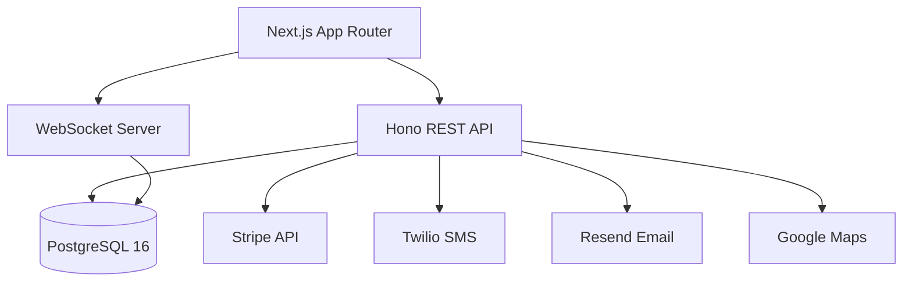
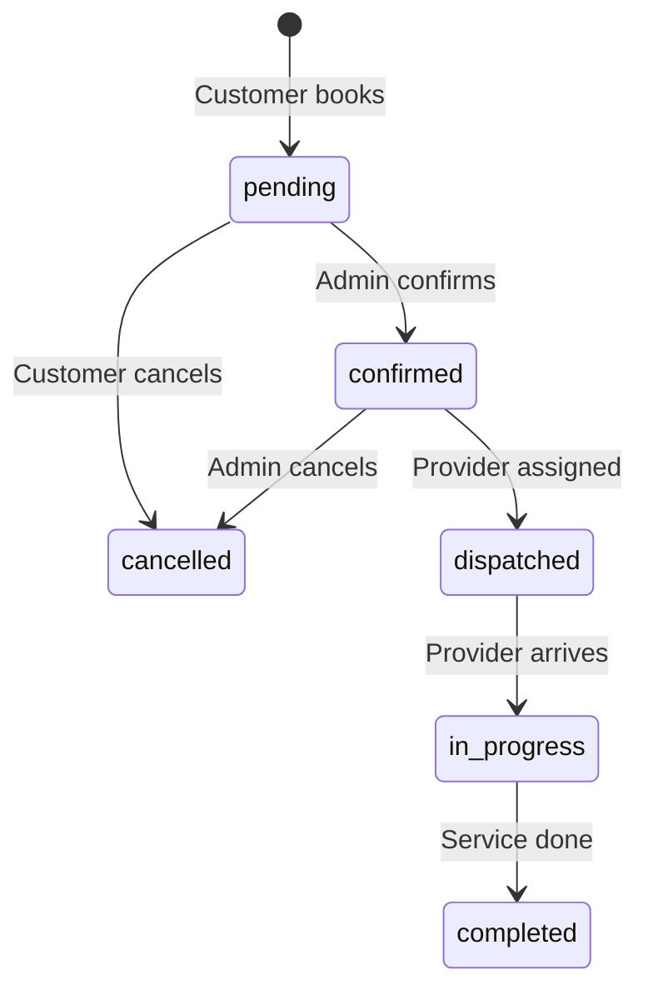
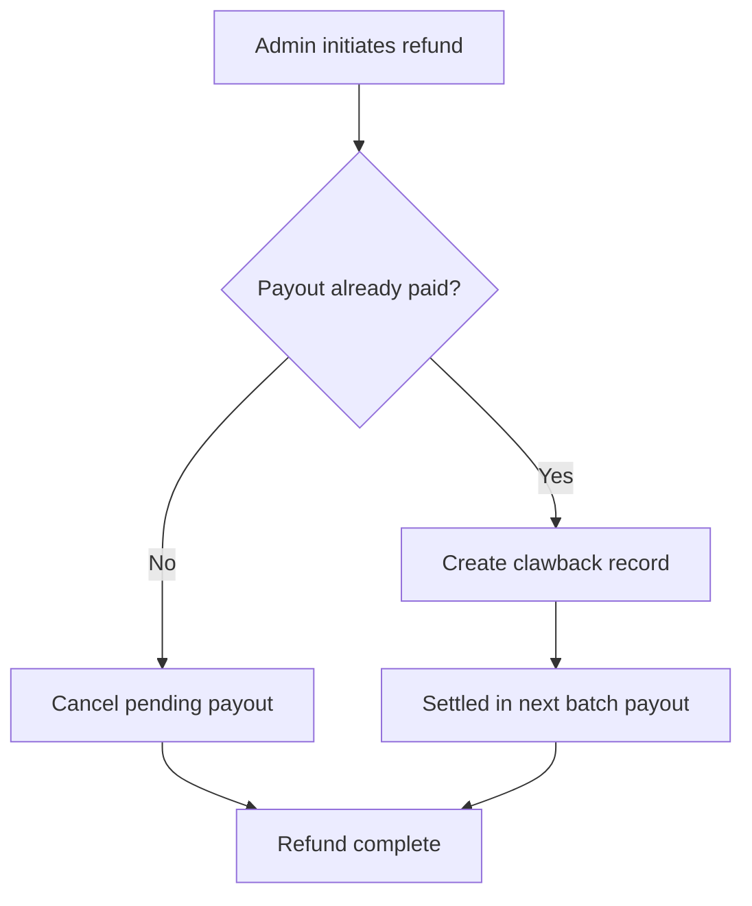
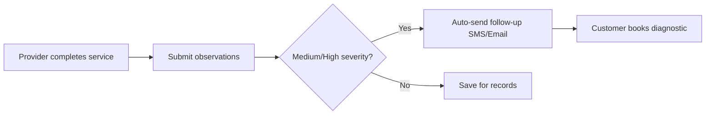
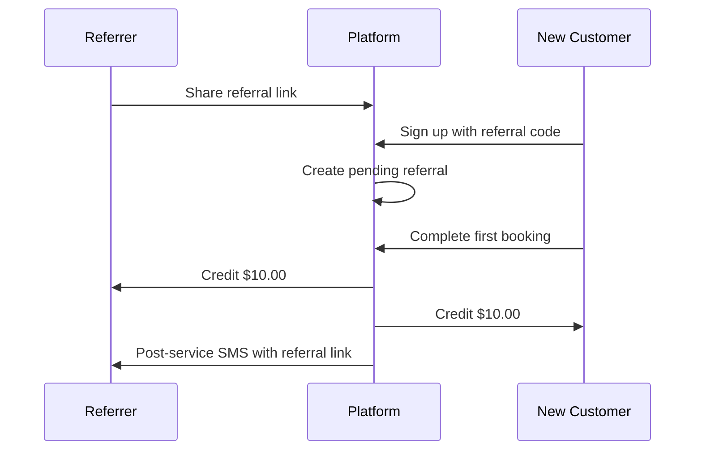

# Technical Feature Catalog - RoadSide ATL

## Table of Contents

- [Platform Overview](#platform-overview)
- [Foundation Features](#foundation-features)
  - [Authentication and Authorization](#authentication-and-authorization)
  - [Service Catalog](#service-catalog)
  - [Booking System](#booking-system)
  - [Auto-Dispatch Engine](#auto-dispatch-engine)
  - [Real-Time Tracking (WebSocket)](#real-time-tracking-websocket)
  - [Payment Processing](#payment-processing)
  - [Provider Portal](#provider-portal)
  - [Admin Dashboard](#admin-dashboard)
  - [Reviews and Ratings](#reviews-and-ratings)
  - [Notifications (SMS, Email, Push)](#notifications-sms-email-push)
  - [SEO and Marketing Pages](#seo-and-marketing-pages)
- [Trust-Based Payment System](#trust-based-payment-system)
- [Dynamic Pricing and Storm Mode](#dynamic-pricing-and-storm-mode)
- [Payment Operations and Tiered Commission](#payment-operations-and-tiered-commission)
- [Enhanced Booking Experience](#enhanced-booking-experience)
- [Financial Reporting and Analytics](#financial-reporting-and-analytics)
- [Vehicle Observation Pipeline](#vehicle-observation-pipeline)
- [Referral Growth Engine](#referral-growth-engine)
- [Branded Inspection Reports](#branded-inspection-reports)
- [B2B Account Management](#b2b-account-management)
- [Cross-Cutting Patterns](#cross-cutting-patterns)

---

## Platform Overview

| Property | Value |
|---|---|
| **Stack** | Next.js 16 + React 19 + Hono 4.11 + Drizzle ORM + PostgreSQL 16 |
| **Auth** | NextAuth.js v5 (JWT sessions) |
| **Real-time** | WebSocket (ws) with heartbeat |
| **Payments** | Stripe + Cash + CashApp + Zelle |
| **Notifications** | Twilio (SMS) + Resend (Email) + VAPID (Push) |
| **Maps** | Google Maps (Places, Geocoding, AdvancedMarker) |
| **Deployment** | Docker on Coolify VPS |



---

## Foundation Features

These features constitute the base platform that was built before the 9 MVP epics.

### Authentication and Authorization

Handles user accounts, login, registration, email verification, and password reset. Supports three roles: `customer`, `admin`, `provider`.

**Schema:** `db/schema/users.ts`, `db/schema/auth.ts`

| Table | Purpose |
|---|---|
| `users` | Core accounts with role-based access |
| `accounts` | OAuth provider links (NextAuth) |
| `sessions` | Server-side session tracking |
| `verification_tokens` | Email verification |
| `password_reset_tokens` | Password reset flow |
| `provider_invite_tokens` | Provider onboarding invites |

**API Routes:** `server/api/routes/auth-routes.ts`

| Endpoint | Auth | Description |
|---|---|---|
| `POST /api/auth-routes/register` | None | Create account with email verification |
| `POST /api/auth-routes/verify-email` | None | Verify email token |
| `POST /api/auth-routes/forgot-password` | None | Send password reset link |
| `POST /api/auth-routes/reset-password` | None | Complete password reset |

**Middleware:** `server/api/middleware/auth.ts`

- `requireAuth` — Valid JWT session
- `requireAdmin` — `user.role === "admin"`
- `requireProvider` — `user.role === "provider"`

**Auth Providers:** Google OAuth, Credentials (email/password), Resend (magic link)

---

### Service Catalog

Manages the catalog of roadside and diagnostic services offered on the platform.

**Schema:** `db/schema/services.ts`

| Column | Type | Description |
|---|---|---|
| `name` | text | Display name |
| `slug` | text | URL-safe identifier |
| `basePrice` | integer | Price in cents |
| `pricePerMile` | integer | Per-mile surcharge (towing) |
| `category` | enum | `roadside` or `diagnostics` |
| `active` | boolean | Visibility toggle |

**Seed Services:**

| Service | Base Price | Category |
|---|---|---|
| Jump Start | $100 | roadside |
| Towing (Local) | $125 + $3/mile | roadside |
| Lockout Service | $135 | roadside |
| Flat Tire Change | $100 | roadside |
| Fuel Delivery | $75 | roadside |
| Car Purchase Diagnostics | $250 | diagnostics |

**API:** `GET /api/services` (public, no auth)

---

### Booking System

Manages the full booking lifecycle from creation through completion. Supports both immediate (emergency) and scheduled bookings.

**Schema:** `db/schema/bookings.ts`

| Column | Type | Description |
|---|---|---|
| `userId` | text (FK) | Customer (nullable for guests) |
| `serviceId` | text (FK) | Requested service |
| `status` | enum | `pending` → `confirmed` → `dispatched` → `in_progress` → `completed` / `cancelled` |
| `vehicleInfo` | jsonb | `{ year, make, model, color }` |
| `location` | jsonb | Address, coordinates, destination, notes |
| `scheduledAt` | timestamp | Null for immediate, set for scheduled |
| `estimatedPrice` | integer | Quoted price (cents) |
| `finalPrice` | integer | Actual price after completion (cents) |
| `priceOverrideCents` | integer | Admin price override |
| `priceOverrideReason` | text | Override justification |



**API Routes:** `server/api/routes/bookings.ts`

| Endpoint | Auth | Description |
|---|---|---|
| `POST /api/bookings` | Optional | Create booking (guest or authenticated) |
| `GET /api/bookings` | Required | List user's bookings |
| `GET /api/bookings/:id` | Required | Get booking detail |
| `PATCH /api/bookings/:id/cancel` | Required | Cancel pending/confirmed booking |

**Key Files:**

- `components/booking/booking-form.tsx` — 4-step wizard (service, location, contact, review)
- `components/booking/payment-instructions.tsx` — Payment method display + Stripe checkout
- `app/(marketing)/book/page.tsx` — Public booking page

---

### Auto-Dispatch Engine

Automatically assigns the nearest available provider when a booking is confirmed.

**Logic:** `server/api/lib/auto-dispatch.ts`

1. Triggered on booking status change to `confirmed`
2. Queries active + available providers within `MAX_DISPATCH_DISTANCE_MILES` (50)
3. Prioritizes specialty match for the service type
4. Creates `dispatch_logs` audit trail with candidate list
5. On provider decline/timeout, cascades to next nearest provider

**Schema:** `db/schema/dispatch-logs.ts`

| Column | Type | Description |
|---|---|---|
| `bookingId` | text (FK) | Dispatched booking |
| `assignedProviderId` | text (FK) | Selected provider |
| `algorithm` | enum | `auto` or `manual` |
| `distanceMeters` | integer | Distance to provider |
| `candidateProviders` | jsonb | Array of candidates with distance and match info |

---

### Real-Time Tracking (WebSocket)

Provides live updates for booking status changes, provider GPS tracking, and job notifications.

**Endpoint:** `ws://host:3000/ws`

**Authentication Flow:**

1. Client connects
2. Sends auth message within 10 seconds: `{ "type": "auth", "userId": string, "role": string }`
3. Server responds: `{ "type": "auth:success" }`

**Events:**

| Event | Direction | Recipients |
|---|---|---|
| `booking:created` | Server → Client | Admins |
| `booking:status_changed` | Server → Client | User + Admins |
| `provider:job_assigned` | Server → Client | Target provider |
| `provider:location_updated` | Server → Client | Admins |

**Key Files:**

- `server-custom.ts` — WebSocket server setup
- `components/providers/websocket-provider.tsx` — React context + `useWS` hook
- `components/maps/live-tracking-map.tsx` — Real-time map with AdvancedMarker

**Configuration:** 30-second heartbeat, auto-disconnect stale connections.

---

### Payment Processing

Handles multi-method payment with Stripe integration for card payments and manual confirmation for cash/CashApp/Zelle.

**Schema:** `db/schema/payments.ts`

| Column | Type | Description |
|---|---|---|
| `bookingId` | text (FK) | Associated booking |
| `amount` | integer | Amount in cents |
| `method` | enum | `cash`, `cashapp`, `zelle`, `stripe` |
| `status` | enum | `pending`, `confirmed`, `failed`, `refunded` |
| `stripeSessionId` | text | Stripe checkout session ID |
| `confirmedBy` | text (FK) | Admin who confirmed manual payment |

**Stripe Integration:**

- `POST /api/payments/stripe/checkout` — Create Stripe Checkout Session
- `POST /api/webhooks/stripe` — Handle `checkout.session.completed`, `charge.refunded`, `checkout.session.expired`

**Manual Payment Flow:** Customer pays via Cash/CashApp/Zelle → Admin confirms in dashboard → Payment status updates to `confirmed`.

---

### Provider Portal

Dedicated interface for service providers to manage jobs, track location, and view earnings.

**API Routes:** `server/api/routes/provider.ts` (all require `requireProvider`)

| Endpoint | Description |
|---|---|
| `GET /api/provider/jobs` | List assigned jobs (paginated, filterable) |
| `PATCH /api/provider/jobs/:id/accept` | Accept job assignment |
| `PATCH /api/provider/jobs/:id/reject` | Reject job (triggers cascade dispatch) |
| `PATCH /api/provider/jobs/:id/status` | Update job status |
| `POST /api/provider/location` | Update GPS coordinates |
| `PATCH /api/provider/availability` | Toggle online/offline |
| `GET /api/provider/stats` | Earnings and performance stats |

**Key Components:**

- `components/provider/job-card.tsx` — Job display with accept/reject
- `components/provider/location-tracker.tsx` — GPS tracking toggle (30s intervals)
- `components/provider/status-updater.tsx` — Job status transitions

---

### Admin Dashboard

Central management interface for bookings, providers, payments, and operations.

**API Routes:** `server/api/routes/admin.ts` (all require `requireAdmin`)

| Endpoint | Description |
|---|---|
| `GET /api/admin/stats` | Dashboard KPIs |
| `GET /api/admin/stats/sparklines` | 7-day trend data |
| `GET /api/admin/bookings` | List/filter/search bookings |
| `PATCH /api/admin/bookings/:id/assign-provider` | Manual provider assignment |
| `PATCH /api/admin/bookings/:id/status` | Update booking status |
| `PATCH /api/admin/payments/:id/confirm` | Confirm manual payment |
| `GET /api/admin/revenue/analytics` | Revenue analytics with date range |
| `GET /api/admin/audit-logs` | Query audit trail |

**Key Components:**

- `components/admin/bookings-table.tsx` — Bookings management with real-time WS updates
- `components/admin/stats-cards.tsx` — KPI cards with sparkline charts
- `components/admin/revenue-analytics.tsx` — Revenue dashboard

---

### Reviews and Ratings

Customer review system with star ratings for providers.

**Schema:** `db/schema/reviews.ts`

| Column | Type | Description |
|---|---|---|
| `bookingId` | text (FK) | Reviewed booking |
| `providerId` | text (FK) | Reviewed provider |
| `rating` | integer | 1-5 stars |
| `comment` | text | Optional review text |

**API Routes:** `server/api/routes/reviews.ts`

| Endpoint | Auth | Description |
|---|---|---|
| `GET /api/reviews/provider/:providerId` | None | Public provider reviews |
| `POST /api/reviews` | Required | Submit review |
| `PATCH /api/reviews/:reviewId` | Required | Edit own review |
| `DELETE /api/reviews/:reviewId` | Admin | Delete review |

**Components:** `components/reviews/star-rating.tsx`, `review-form.tsx`, `reviews-list.tsx`

---

### Notifications (SMS, Email, Push)

Multi-channel notification system for booking updates, provider alerts, and marketing.

| Channel | Provider | Use Cases |
|---|---|---|
| SMS | Twilio | Booking confirmations, provider dispatch, referral texts |
| Email | Resend | Verification, receipts, inspection reports, invoices |
| Push | VAPID | Real-time job alerts, status updates |

**Push API:** `server/api/routes/push.ts`

| Endpoint | Description |
|---|---|
| `POST /api/push/subscribe` | Subscribe to push notifications |
| `POST /api/push/unsubscribe` | Unsubscribe |
| `GET /api/push/status` | Check subscription status |

---

### SEO and Marketing Pages

Server-rendered marketing pages with structured data for search engines.

**Components:**

- `components/seo/json-ld.tsx` — Exports `LocalBusinessJsonLd`, `ServiceJsonLd`, `FAQJsonLd`, `BreadcrumbJsonLd`, `WebSiteJsonLd`
- `components/marketing/hero.tsx`, `navbar.tsx`, `service-card.tsx`, `footer.tsx`

**Route Groups:** `app/(marketing)/` — Public pages (homepage, services, booking, about)

---

## Trust-Based Payment System

Prevents chargebacks by restricting new customers to non-reversible payment methods until they earn trust through clean transactions.

**Problem Solved:** Industry chargeback rate averages 0.80%. Visa's threshold is 1.5%. One bad month can kill a merchant account.

### Schema

Added to `users` table:

| Column | Type | Default | Description |
|---|---|---|---|
| `trustTier` | integer | `1` | Current trust level (1 or 2) |
| `cleanTransactionCount` | integer | `0` | Completed transactions without disputes |

`platform_settings` table stores configurable promotion threshold.

### Tier Rules

| Tier | Allowed Methods | How to Reach |
|---|---|---|
| Tier 1 (new) | Cash, CashApp, Zelle | Default for all new customers |
| Tier 2 (trusted) | Cash, CashApp, Zelle, **Stripe** | Complete N clean transactions (default: 3) |

### Business Logic

**File:** `server/api/lib/trust-tier.ts`

- `getAllowedPaymentMethods(userId)` — Returns whitelist based on tier
- `getPromotionThreshold()` — Reads threshold from `platform_settings`
- `incrementCleanTransaction(userId)` — Atomically increments count, auto-promotes when threshold reached
- `checkAndPromote(userId)` — Manual promotion check

### API Routes

**File:** `server/api/routes/trust-tier.ts`

| Endpoint | Auth | Description |
|---|---|---|
| `GET /api/trust-tier` | Admin | List customers with tier info (searchable, paginated) |
| `GET /api/trust-tier/config` | Admin | Get promotion threshold |
| `PATCH /api/trust-tier/config` | Admin | Update promotion threshold |
| `PATCH /api/trust-tier/:userId` | Admin | Manual promote/demote |

### UI

- `components/admin/trust-tier-table.tsx` — Admin management table
- `components/dashboard/trust-tier-card.tsx` — Customer-facing tier display
- `app/(admin)/admin/trust-tier/page.tsx` — Admin trust tier page

---

## Dynamic Pricing and Storm Mode

Applies time-based price multipliers to service pricing. Storm Mode activates emergency surge pricing during severe weather or high-demand events.

### Schema

**Table:** `time_block_configs` — `db/schema/time-block-configs.ts`

| Column | Type | Description |
|---|---|---|
| `name` | text | Block label (e.g., "After Hours", "Storm Mode") |
| `startHour` | integer | Start hour (0-23) |
| `endHour` | integer | End hour (0-23) |
| `multiplier` | integer | Basis points (10000 = 1.0x, 15000 = 1.5x) |
| `priority` | integer | Higher values override (storm mode >= 100) |
| `isActive` | boolean | Toggle on/off |

**Overnight Support:** When `startHour > endHour` (e.g., 18-6), the system wraps across midnight.

### Business Logic

**File:** `server/api/lib/pricing-engine.ts`

```typescript
calculateBookingPrice(serviceId, scheduledAt?) → {
  basePrice: number,
  multiplier: number,
  blockName: string,
  finalPrice: number
}
```

- Finds all active time blocks matching the booking hour
- Applies the highest priority block
- Falls back to `DEFAULT_MULTIPLIER_BP` (10000 = 1.0x)

### API Routes

**File:** `server/api/routes/pricing-config.ts`

| Endpoint | Auth | Description |
|---|---|---|
| `GET /api/pricing-config` | Admin | List all time-block configs |
| `GET /api/pricing-config/storm-mode/status` | Admin | Get storm mode status |
| `POST /api/pricing-config/storm-mode/activate` | Admin | Activate storm template (deactivates others) |
| `POST /api/pricing-config/storm-mode/deactivate` | Admin | Deactivate storm mode |
| `PUT /api/pricing-config/:id` | Admin | Update time-block config |

**File:** `server/api/routes/pricing-estimate.ts`

| Endpoint | Auth | Description |
|---|---|---|
| `GET /api/pricing-estimate` | None | Get price for service + time |

### Constants

- `DEFAULT_MULTIPLIER_BP` = 10000 (1.0x)
- `STORM_MODE_PRIORITY` = 100
- `DEFAULT_COMMISSION_RATE_BP` = 2500 (25%)
- `COMMISSION_RATE_DIAGNOSTICS_BP` = 2000 (20%)

### UI

- `components/admin/pricing-config-table.tsx` — Time block management
- `app/(admin)/admin/pricing/page.tsx` — Pricing admin page

---

## Payment Operations and Tiered Commission

Extends the payment system with refund processing, batch payouts, tiered commission by service category, and clawback handling.

### Schema Additions

**payments** — Added refund fields:

| Column | Type | Description |
|---|---|---|
| `refundAmount` | integer | Refund amount in cents |
| `refundedAt` | timestamp | When refund was processed |
| `refundedBy` | text (FK) | Admin who issued refund |
| `refundReason` | text | Refund justification |

**provider_payouts** — Added clawback support:

| Column | Type | Description |
|---|---|---|
| `payoutType` | text | `standard` or `clawback` |
| `originalPayoutId` | text | Links clawback to original payout |

### Tiered Commission

**File:** `server/api/lib/payout-calculator.ts`

Commission priority chain:

1. **Provider flat fee** — `flatFeeAmount` on provider record (if `commissionType === 'flat_per_job'`)
2. **Service-level rate** — Per-service commission rate override
3. **Provider-level rate** — `commissionRate` basis points (default: 7000 = 70%)

Default rates:

| Category | Platform Take | Provider Keeps |
|---|---|---|
| Roadside | 25% | 75% |
| Diagnostics | 20% | 80% |
| Premium/Towing | 30% | 70% |

### Refund and Clawback Flow



### API Routes

**File:** `server/api/routes/admin-payouts.ts`

| Endpoint | Auth | Description |
|---|---|---|
| `GET /api/admin/payouts` | Admin | List payouts (filterable by status/provider) |
| `POST /api/admin/payouts/mark-paid` | Admin | Batch mark payouts as paid |
| `POST /api/admin/payouts/refund` | Admin | Initiate refund with auto-clawback |
| `GET /api/admin/payouts/outstanding` | Admin | Outstanding clawback balances per provider |
| `GET /api/admin/payouts/summary` | Admin | Aggregate payout summary |

**Implementation Details:**

- Atomic transactions for refund + clawback creation
- Double-refund prevention via transaction isolation
- Fire-and-forget audit logging

---

## Enhanced Booking Experience

Improves the booking flow with mode toggle, transparent pricing, diagnostic product tiers, GPS auto-detection, and provider tracking.

### Booking Mode Toggle

The booking form supports two modes via the `scheduledAt` field:

| Mode | `scheduledAt` | Use Case |
|---|---|---|
| Immediate | `null` | Emergency roadside (dispatch ASAP) |
| Scheduled | ISO timestamp | Diagnostic appointments, planned services |

### Transparent Pricing Display

The booking form shows a real-time price breakdown:

1. Base service price
2. Time-block multiplier (if applicable)
3. Towing per-mile surcharge (if towing)
4. Referral credit applied (if any)
5. Final price

**Pricing Estimate API:** `GET /api/pricing-estimate?serviceId=X&scheduledAt=Y`

### Diagnostic Product Tiers

For `diagnostics` category services:

| Tier | Price | Includes |
|---|---|---|
| Basic | $250 | Mechanical inspection + OBD2 + branded PDF |
| Standard | $325 | Basic + tow-if-fails |
| Premium | $400 | Standard + 72-hour guarantee |

### Location Detection

- Google Maps Places autocomplete (Atlanta-biased) via `components/maps/address-autocomplete.tsx`
- Server-side geocoding fallback via `POST /api/geocoding/address`
- GPS auto-fill from browser Geolocation API

### Real-Time Provider Tracking

- `components/maps/live-tracking-map.tsx` — Google Maps with AdvancedMarker
- Provider GPS updates every 30 seconds via `components/provider/location-tracker.tsx`
- Live position broadcast through WebSocket

### Booking Lifecycle Notifications

| Event | SMS | Email | Push |
|---|---|---|---|
| Booking created | Customer | Customer | Admin |
| Provider dispatched | Customer | - | Provider |
| Provider arrived | Customer | - | - |
| Service completed | Customer | Receipt | Admin |
| Booking cancelled | Customer | - | Admin |

---

## Financial Reporting and Analytics

Provides multi-dimensional revenue analytics with drill-down filtering and CSV export.

### API Routes

**File:** `server/api/routes/financial-reports.ts`

| Endpoint | Auth | Description |
|---|---|---|
| `GET /api/financial-reports/overview` | Admin | KPI dashboard (pending payments, payout queue, active bookings, online providers) |
| `GET /api/financial-reports/revenue-breakdown` | Admin | Multi-dimensional revenue analysis |
| `GET /api/financial-reports/revenue-breakdown/export` | Admin | CSV export |

### Revenue Breakdown Dimensions

| Dimension | Values |
|---|---|
| By source | B2C, B2B |
| By category | Roadside, Diagnostics |
| By payment method | Cash, CashApp, Zelle, Stripe |
| By time-block tier | Standard, After-Hours, Storm Mode |
| Daily trend | Revenue by day in date range |

**Query Parameters:** `startDate`, `endDate` (ISO date strings)

### Provider Earnings View

Providers access their earnings through `GET /api/provider/stats`:

- Total earnings (lifetime, this month, this week)
- Job count by status
- Payout history with pending/paid breakdown

### Admin 1099 Export

**Endpoint:** `GET /api/admin/revenue/export`

Generates CSV with per-provider annual earnings for tax reporting (1099 preparation).

---

## Vehicle Observation Pipeline

Enables providers to note vehicle issues during service, triggering automated follow-up notifications to customers for diagnostic upsells.

### Schema

**Table:** `observations` — `db/schema/observations.ts`

| Column | Type | Description |
|---|---|---|
| `bookingId` | text (FK) | Service booking |
| `providerId` | text (FK) | Submitting provider |
| `items` | jsonb | Array of `ObservationItem` |
| `followUpSent` | boolean | Whether customer was notified |

**ObservationItem:**

```typescript
{
  category: string       // e.g., "Battery", "Brakes", "Tires"
  description: string    // What the provider noticed
  severity: "low" | "medium" | "high"
  photoUrl?: string      // Optional photo evidence
}
```

### Flow



### API Routes

**File:** `server/api/routes/observations.ts`

| Endpoint | Auth | Description |
|---|---|---|
| `POST /api/observations` | Provider | Submit observation (auto-follow-up for medium/high) |
| `GET /api/observations` | Provider | List provider's observations (paginated) |
| `GET /api/observations/:id` | Provider/Admin | Get observation detail |
| `GET /api/observations/checklist/:serviceId` | Provider | Get service-specific checklist |

**Constraints:** One observation per booking (duplicate prevention).

### UI

- `components/provider/observation-form.tsx` — Checklist-based submission form
- `app/(provider)/provider/observations/page.tsx` — Provider observations page

---

## Referral Growth Engine

Two-sided referral system where both referrer and referee receive credits. Supports customer-to-customer and provider-to-provider referrals.

### Schema

**Table:** `referrals` — `db/schema/referrals.ts`

| Column | Type | Description |
|---|---|---|
| `referrerId` | text (FK) | User who referred |
| `refereeId` | text (FK) | User who was referred |
| `bookingId` | text (FK) | Qualifying booking |
| `creditAmount` | integer | Credit amount in cents |
| `status` | enum | `pending`, `credited`, `expired` |

**Users table addition:** `referralCode` — Unique 8-character code per user.

### Business Logic

**File:** `server/api/lib/referral-credits.ts`

- `generateReferralCode()` — 8-char unique code (3 retries on collision)
- `calculateCreditBalance(userId)` — Earned credits minus redeemed
- `redeemReferralCredits(userId, bookingId, amount)` — Apply credits to booking
- `creditReferralOnFirstBooking(refereeId)` — Auto-credit on referee's first completed booking

**Constants:** `REFERRAL_CREDIT_AMOUNT_CENTS` = 1000 ($10.00)

### API Routes

**File:** `server/api/routes/referrals.ts`

| Endpoint | Auth | Description |
|---|---|---|
| `GET /api/referrals/me` | Required | Get referral code, link, and credit balance |
| `GET /api/referrals` | Required | List user's referrals (paginated) |
| `POST /api/referrals/validate` | None | Validate referral code at signup |
| `POST /api/referrals/apply` | Required | Apply referral code post-booking |
| `GET /api/referrals/me/balance` | Required | Available credit balance |
| `POST /api/referrals/redeem` | Required | Redeem credits on a booking |
| `POST /api/referrals/provider-refer` | Provider | Provider-to-provider referral |
| `GET /api/referrals/provider` | Provider | Provider's referral history |

### Referral Flow



### UI

- `components/booking/referral-credit-selector.tsx` — Apply credits during booking
- `app/(dashboard)/dashboard/referrals/page.tsx` — Customer referral dashboard
- `app/(provider)/provider/referrals/page.tsx` — Provider referral page

---

## Branded Inspection Reports

Generates professional PDF inspection reports for diagnostic services. Reports include findings, OBD2 codes, photos, and pass/fail summaries.

### Schema

**Table:** `inspection_reports` — `db/schema/inspection-reports.ts`

| Column | Type | Description |
|---|---|---|
| `bookingId` | text (FK) | Inspection booking |
| `providerId` | text (FK) | Inspector |
| `findings` | jsonb | Array of `InspectionFinding` |
| `reportUrl` | text | Generated PDF URL |
| `emailedAt` | timestamp | When emailed to customer |

**InspectionFinding:**

```typescript
{
  category: string         // e.g., "Engine", "Transmission", "Brakes"
  component: string        // Specific part inspected
  condition: "good" | "fair" | "poor" | "critical"
  description: string      // Detailed finding
  measurement?: string     // Tread depth, fluid level, etc.
  photoUrl?: string        // Evidence photo
  obdCode?: string         // OBD2 diagnostic code
}
```

### Business Logic

**File:** `server/api/lib/pdf-generator.ts`

Generates branded PDF with:

- Company header with RoadSide ATL branding
- Vehicle information (year, make, model)
- Inspector details (name, date)
- Categorized findings table with color-coded conditions
- OBD2 codes and measurements
- Pass/fail summary

### API Routes

**File:** `server/api/routes/inspection-reports.ts`

| Endpoint | Auth | Description |
|---|---|---|
| `POST /api/inspection-reports` | Provider | Submit inspection report |
| `GET /api/inspection-reports/provider/list` | Provider | List provider's reports (paginated) |
| `GET /api/inspection-reports/:id` | Provider/Admin/Customer | Get report detail |
| `GET /api/inspection-reports/:id/pdf` | Provider/Admin/Customer | Download branded PDF |
| `POST /api/inspection-reports/:id/email` | Provider/Admin | Email report to customer (idempotent) |

**Constraints:** One report per booking (duplicate prevention). Email send is idempotent (checks `emailedAt`).

### UI

- `components/provider/inspection-form.tsx` — Multi-finding submission form
- `components/provider/inspection-preview.tsx` — Live report preview
- `app/(provider)/provider/inspections/page.tsx` — Provider inspections page

---

## B2B Account Management

Manages business accounts with contract-based pricing, priority dispatch, monthly invoicing, and dedicated booking.

### Schema

**Table:** `b2b_accounts` — `db/schema/b2b-accounts.ts`

| Column | Type | Description |
|---|---|---|
| `companyName` | text | Business name |
| `contactName/Email/Phone` | text | Primary contact |
| `billingAddress` | jsonb | `{ street, city, state, zip }` |
| `paymentTerms` | enum | `prepaid`, `net_30`, `net_60` |
| `status` | enum | `pending`, `active`, `suspended` |
| `contract` | jsonb | Contract terms (see below) |

**B2bContract:**

```typescript
{
  retainerAmountCents: number    // Monthly retainer
  perJobRateCents?: number       // Override per-service rate
  includedServiceIds: string[]   // Covered services
  startDate: string              // Contract start
  endDate: string                // Contract end
}
```

**Table:** `invoices` — `db/schema/invoices.ts`

| Column | Type | Description |
|---|---|---|
| `invoiceNumber` | text | Unique sequenced (INV-YYYY-XXXXX) |
| `b2bAccountId` | text (FK) | Linked B2B account |
| `status` | enum | `draft`, `sent`, `issued`, `paid`, `overdue`, `cancelled`, `void` |
| `lineItems` | jsonb | Array of line items |
| `subtotalCents` | integer | Pre-tax total |
| `taxCents` | integer | Tax amount |
| `totalCents` | integer | Final total |
| `billingPeriodStart/End` | timestamp | For monthly billing |
| `dueDate` | timestamp | Calculated from payment terms |

### Business Logic

**File:** `server/api/lib/invoice-generator.ts`

- `generateInvoiceNumber()` — Atomic sequence: `INV-YYYY-XXXXX`
- `createInvoiceForBooking(bookingId)` — Auto-invoice on booking completion
- `createB2bMonthlyInvoice(accountId, periodStart, periodEnd)` — Batch billing

**File:** `lib/invoices/generate-invoice-html.ts` — Branded HTML invoice rendering

### API Routes

**File:** `server/api/routes/b2b-accounts.ts`

| Endpoint | Auth | Description |
|---|---|---|
| `GET /api/b2b-accounts` | Admin | List accounts (searchable, filterable, paginated) |
| `POST /api/b2b-accounts` | Admin | Create account |
| `GET /api/b2b-accounts/:id` | Admin | Get account detail with booking count |
| `PATCH /api/b2b-accounts/:id` | Admin | Update account info |
| `PATCH /api/b2b-accounts/:id/contract` | Admin | Update contract terms |
| `PATCH /api/b2b-accounts/:id/status` | Admin | Suspend/reactivate |
| `POST /api/b2b-accounts/:id/bookings` | Admin | Create booking for B2B account |
| `GET /api/b2b-accounts/:id/invoices` | Admin | List account invoices |
| `POST /api/b2b-accounts/:id/invoices` | Admin | Generate monthly invoice |

**File:** `server/api/routes/admin-invoices.ts`

| Endpoint | Auth | Description |
|---|---|---|
| `GET /api/admin/invoices` | Admin | List all invoices (filterable) |
| `GET /api/admin/invoices/:id` | Admin | Get invoice detail |
| `PATCH /api/admin/invoices/:id/status` | Admin | Update invoice status |
| `GET /api/admin/invoices/:id/pdf` | Admin | Download invoice PDF |
| `POST /api/admin/invoices/:id/send` | Admin | Email invoice to customer |

### UI

- `components/admin/b2b-accounts-table.tsx` — Account management table
- `app/(admin)/admin/b2b-accounts/page.tsx` — B2B admin page
- `app/(marketing)/my-invoices/page.tsx` — Customer invoice view

---

## Cross-Cutting Patterns

### Audit Logging

**File:** `server/api/lib/audit-logger.ts`

- Buffered writes (batch every 1 second or 50 entries)
- Auto-creates `audit_logs` table if not present
- Tracks 20+ action types: bookings, providers, payments, users, dispatch, trust tier, referrals
- Every financial mutation is logged with timestamp, actor, and before/after state

### Rate Limiting

**File:** `server/api/lib/rate-limiter.ts`

| Tier | Limit | Use Case |
|---|---|---|
| `standard` | 100 req/min | General API access |
| `strict` | 20 req/min | Sensitive operations (bookings, payments) |
| `auth` | 10 req/5 min | Login, registration, password reset |
| `notifications` | 5 req/min | Push notification operations |
| `webhooks` | 200 req/min | Stripe webhook processing |

### Transaction Safety

- Trust tier promotion uses atomic increment + conditional update
- Refund processing uses DB transactions with clawback creation
- Invoice number generation uses atomic sequence
- Double-refund prevention via transaction isolation

### Multi-Tenancy

All core tables include a nullable `tenantId` column for future multi-tenant support. Currently unused (single-tenant deployment).

### Price Override Chain

When calculating the final booking price:

1. Base service price
2. Time-block multiplier applied
3. Towing per-mile surcharge (if applicable)
4. Admin price override (if set)
5. Referral credit deduction (if redeemed)
6. Final price stored on booking
